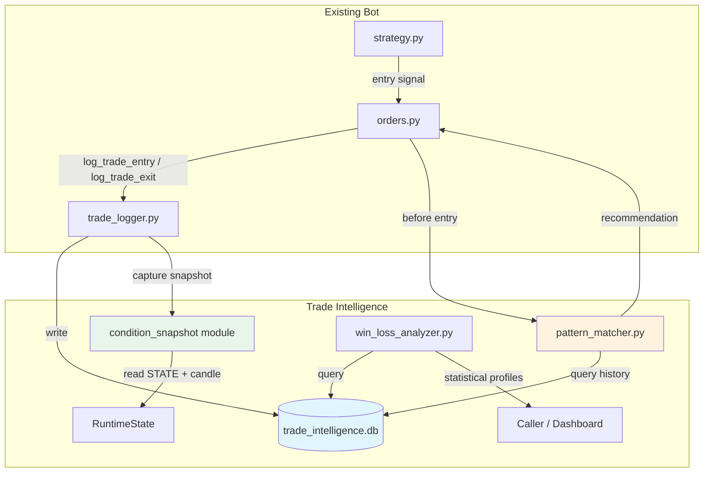

# Design Document: Trade Intelligence System

## Overview

The Trade Intelligence System adds a data-driven analysis layer to the existing BankNifty/Nifty EMA-based options trading bot. It replaces the Excel-based trade logger (`logger_excel.py`) with a SQLite-backed system that captures rich market condition snapshots at every trade entry and exit, then uses historical pattern analysis to filter future entries.

The system is designed as a set of new Python modules that integrate into the existing bot with minimal changes to `orders.py`. The core flow is:

1. **Trade Logging** — `log_trade_entry` / `log_trade_exit` write to SQLite instead of Excel, capturing the same fields plus a linked condition snapshot.
2. **Condition Snapshots** — At entry and exit, 20+ market parameters (EMA gap, cycle phase, price zone, candle metrics, etc.) are captured from `RuntimeState` and the current candle.
3. **Pattern Matching** — Before each entry, historical snapshots for the same entry type are queried, compared via range-based tolerance bands with recency weighting, and a SKIP/CONFIRM/NEUTRAL recommendation is produced.
4. **Win/Loss Analysis** — Statistical profiles (mean, median, std) of winning vs losing trades are computed per entry type and instrument.

### Design Decisions

- **SQLite over PostgreSQL/Redis**: The bot runs as a single process on one machine. SQLite with WAL mode provides concurrent reads, zero deployment overhead, and file-based portability. The dataset (hundreds to low thousands of trades) fits comfortably.
- **Drop-in replacement for logger_excel.py**: The new `trade_logger.py` exposes identical function signatures (`log_trade_entry`, `log_trade_exit`, `update_metrics`) so that `orders.py` only needs an import change.
- **LOG_ONLY mode default**: Pattern matching starts in log-only mode (recommendations logged but trades not blocked) to build confidence before enabling real filtering.
- **Condition snapshot as separate table**: Snapshots are stored in their own table with a foreign key to trades, allowing entry and exit snapshots per trade and enabling direct SQL queries across condition dimensions.

## Architecture



### Module Layout

```
app/
├── trade_logger.py        # SQLite trade logging (replaces logger_excel.py)
├── trade_db.py            # Database initialization, connection management, schema
├── condition_snapshot.py   # Snapshot capture logic, reads STATE + candle
├── pattern_matcher.py      # Historical pattern comparison, SKIP/CONFIRM/NEUTRAL
├── win_loss_analyzer.py    # Statistical win/loss profiles by entry type
```

### Integration Flow

**Entry flow (modified):**
1. `strategy_loop()` detects entry signal → calls `enter_trade()` in `orders.py`
2. `enter_trade()` calls `pattern_matcher.evaluate(entry_type, candle)` before placing the order
3. Pattern matcher queries DB, computes recommendation, logs it
4. If LOG_ONLY=True or recommendation != SKIP → proceed with order
5. After order placed, `log_trade_entry()` writes trade record + entry condition snapshot to DB

**Exit flow (modified):**
1. `_exit_position()` captures exit condition snapshot
2. `log_trade_exit()` writes exit snapshot + updates trade record in DB

## Components and Interfaces

### 1. trade_db.py — Database Layer

Handles SQLite connection lifecycle, schema creation, and migrations.

```python
# Public interface
def get_connection() -> sqlite3.Connection:
    """Return a connection to the trade intelligence DB. Creates DB + tables if needed."""

def init_db() -> None:
    """Create database file and all tables if they don't exist. Enables WAL mode."""

def ensure_tables(conn: sqlite3.Connection) -> None:
    """Create missing tables without altering existing data."""
```

**Key behaviors:**
- Database path is configurable via `TRADE_DB_PATH` in config (default: `data/trade_intelligence.db`)
- WAL journal mode enabled on first connection
- Foreign keys enforced (`PRAGMA foreign_keys = ON`)
- Connection uses `check_same_thread=False` for thread safety with the bot's lock

### 2. trade_logger.py — Trade Logging

Drop-in replacement for `logger_excel.py` with identical function signatures.

```python
def log_trade_entry(
    trade_id, symbol, instrument, side, qty, entry_price,
    trade_count, reason="Trade opened", atr=None, sl=None,
    target=None, entry_type=None
) -> None:
    """Insert trade record + entry condition snapshot into DB."""

def log_trade_exit(
    trade_id, exit_price, result, reason, status="CLOSED"
) -> None:
    """Update trade record with exit data + insert exit condition snapshot."""

def update_metrics() -> dict:
    """Compute and return trading metrics from the trades table."""

def get_metrics(date_from=None, date_to=None, instrument=None, entry_type=None) -> dict:
    """Compute filtered metrics. Superset of update_metrics."""
```

**Key behaviors:**
- Duplicate trade_id prevention via `INSERT OR IGNORE` with UNIQUE constraint
- Symbol validation: rejects symbols other than BANKNIFTY/NIFTY
- All DB writes wrapped in try/except — errors logged, bot continues
- Condition snapshot captured by calling `condition_snapshot.capture()` internally

### 3. condition_snapshot.py — Snapshot Capture

Reads current market state from `RuntimeState` and the candle to build a snapshot dict.

```python
@dataclass
class ConditionSnapshot:
    trade_id: str
    snapshot_type: str          # "ENTRY" or "EXIT"
    ema9: float
    ema21: float
    ema_gap: float
    ema_gap_atr: float          # abs(ema9 - ema21) / ATR
    ema_cycle_phase: str        # SIDEWAYS/EXPANDING/PEAK/CONTRACTING
    phase_duration: int         # candles in current phase
    price_distance_ema9: float
    price_distance_ema21: float
    price_dist_ema9_atr: float
    price_dist_ema21_atr: float
    price_ema9_momentum: str    # EXPANDING/SHRINKING/FLAT
    price_zone: str             # OVEREXTENDED/STRETCHED/NORMAL/NEAR_EMA9
    candle_open: float
    candle_high: float
    candle_low: float
    candle_close: float
    candle_body_ratio: float    # abs(close-open)/(high-low), 0.0 if range=0
    candle_range_atr: float     # (high-low)/ATR
    atr_value: float
    entry_type: str
    time_of_day: str            # HH:MM format
    index_ltp: float | None
    # Exit-only fields
    trade_result: str | None    # WIN/LOSS/FLAT (exit only)
    exit_reason: str | None     # (exit only)

def capture(trade_id: str, snapshot_type: str, candle, entry_type: str,
            trade_result: str = None, exit_reason: str = None) -> ConditionSnapshot:
    """Build a ConditionSnapshot from current RuntimeState and candle data."""

def to_db_row(snapshot: ConditionSnapshot) -> tuple:
    """Convert snapshot to a tuple for DB insertion."""

def from_db_row(row: sqlite3.Row) -> ConditionSnapshot:
    """Reconstruct a ConditionSnapshot from a DB row."""
```

**Computed fields:**
- `ema_gap_atr` = `abs(ema9 - ema21) / atr_value`
- `candle_body_ratio` = `abs(close - open) / (high - low)` when range > 0, else 0.0
- `candle_range_atr` = `(high - low) / atr_value`
- `phase_duration` = `STATE.ema_gap_expanding_count` when phase is EXPANDING, `STATE.ema_gap_contracting_count` when CONTRACTING, 0 for SIDEWAYS/PEAK
- `price_ema9_momentum` = compare current `price_dist_ema9` with `prev_price_dist_ema9` from STATE

### 4. pattern_matcher.py — Pattern Matching

Compares current conditions against historical trade outcomes.

```python
@dataclass
class MatchResult:
    recommendation: str         # "SKIP", "CONFIRM", "NEUTRAL"
    win_count: int
    loss_count: int
    total_matches: int
    win_profile: dict           # average condition values for winning matches
    loss_profile: dict          # average condition values for losing matches
    match_details: str          # human-readable summary

def evaluate(entry_type: str, candle, instrument: str) -> MatchResult:
    """Query historical trades, compute match, return recommendation."""
```

**Matching algorithm:**
1. Query all CLOSED trades with same `entry_type` and matching `LIVE_SYMBOL`
2. If fewer than 20 trades → return NEUTRAL
3. For each condition dimension, check if historical value falls within `current_value ± tolerance_band`:
   - Dimensions: `ema_gap_atr`, `price_dist_ema9_atr`, `phase_duration`, `candle_body_ratio`, `candle_range_atr`, `time_of_day_bucket`
   - Default tolerance: ±20% (configurable via `PATTERN_TOLERANCE_PCT`)
4. Apply recency weighting: last 5 days → 2x, last 10 days → 1.5x, older → 1x
5. Compute weighted win/loss counts from matching trades
6. If no matches within tolerance → fall back to nearest N trades (default N=10) by weighted Euclidean distance
7. If weighted loss ratio > `PATTERN_SKIP_THRESHOLD` (default 0.70) → SKIP
8. If weighted win ratio > `PATTERN_CONFIRM_THRESHOLD` (default 0.60) → CONFIRM
9. Otherwise → NEUTRAL

**Time-of-day bucketing:** Trading hours (9:15–15:30) divided into 30-minute buckets (e.g., "09:15", "09:45", "10:15", ...). Matching uses bucket equality.

**Performance:** All matching is done in-memory after a single SQL query. With <5000 trades, this completes well within the 100ms budget.

### 5. win_loss_analyzer.py — Statistical Analysis

```python
@dataclass
class EntryTypeProfile:
    entry_type: str
    instrument: str
    sample_size: int
    sufficient_data: bool       # True if >= 10 trades
    win_profile: dict           # {dimension: {mean, median, std}}
    loss_profile: dict          # {dimension: {mean, median, std}}
    top_discriminators: list    # top 3 features with largest win/loss separation

def analyze(entry_type: str = None, instrument: str = None) -> dict[str, EntryTypeProfile]:
    """Compute win/loss profiles grouped by entry_type and instrument."""
```

**Analysis dimensions:** `ema_gap_atr`, `price_dist_ema9_atr`, `phase_duration`, `candle_body_ratio`, `time_of_day`

**Discrimination metric:** For each dimension, compute `abs(win_mean - loss_mean) / max(win_std, loss_std, 0.001)`. Top 3 by this ratio are the top discriminators.

## Data Models

### SQLite Schema

```sql
CREATE TABLE IF NOT EXISTS trades (
    trade_id TEXT PRIMARY KEY,
    entry_time TEXT NOT NULL,
    exit_time TEXT,
    symbol TEXT NOT NULL,
    instrument TEXT NOT NULL,        -- CE, PE, FUT
    side TEXT NOT NULL,              -- BUY, SELL
    qty INTEGER NOT NULL,
    entry_price REAL NOT NULL,
    exit_price REAL,
    pnl REAL,
    result TEXT,                     -- WIN, LOSS, FLAT
    reason TEXT,
    trade_count INTEGER,
    status TEXT NOT NULL DEFAULT 'OPEN',  -- OPEN, CLOSED
    equity REAL,
    atr REAL,
    sl REAL,
    target REAL,
    entry_type TEXT,                 -- CROSSOVER, PREBUY, PRESELL, TREND, HIGHER_LOW, REENTRY, REEXPANSION
    duration_seconds INTEGER,
    created_at TEXT NOT NULL DEFAULT (datetime('now'))
);

CREATE TABLE IF NOT EXISTS condition_snapshots (
    id INTEGER PRIMARY KEY AUTOINCREMENT,
    trade_id TEXT NOT NULL,
    snapshot_type TEXT NOT NULL,     -- ENTRY, EXIT
    ema9 REAL,
    ema21 REAL,
    ema_gap REAL,
    ema_gap_atr REAL,
    ema_cycle_phase TEXT,
    phase_duration INTEGER,
    price_distance_ema9 REAL,
    price_distance_ema21 REAL,
    price_dist_ema9_atr REAL,
    price_dist_ema21_atr REAL,
    price_ema9_momentum TEXT,
    price_zone TEXT,
    candle_open REAL,
    candle_high REAL,
    candle_low REAL,
    candle_close REAL,
    candle_body_ratio REAL,
    candle_range_atr REAL,
    atr_value REAL,
    entry_type TEXT,
    time_of_day TEXT,
    index_ltp REAL,
    trade_result TEXT,              -- WIN, LOSS, FLAT (exit snapshots only)
    exit_reason TEXT,               -- (exit snapshots only)
    captured_at TEXT NOT NULL DEFAULT (datetime('now')),
    FOREIGN KEY (trade_id) REFERENCES trades(trade_id)
);

CREATE INDEX IF NOT EXISTS idx_snapshots_trade_id ON condition_snapshots(trade_id);
CREATE INDEX IF NOT EXISTS idx_snapshots_entry_type ON condition_snapshots(entry_type, snapshot_type);
CREATE INDEX IF NOT EXISTS idx_trades_symbol ON trades(symbol);
CREATE INDEX IF NOT EXISTS idx_trades_entry_type ON trades(entry_type);
CREATE INDEX IF NOT EXISTS idx_trades_status ON trades(status);
```

### Configuration Additions (config.py / .env)

```python
# Trade Intelligence settings
TRADE_DB_PATH = DATA_DIR / "trade_intelligence.db"
PATTERN_TOLERANCE_PCT = float(os.getenv("PATTERN_TOLERANCE_PCT", "0.20"))
PATTERN_SKIP_THRESHOLD = float(os.getenv("PATTERN_SKIP_THRESHOLD", "0.70"))
PATTERN_CONFIRM_THRESHOLD = float(os.getenv("PATTERN_CONFIRM_THRESHOLD", "0.60"))
PATTERN_MIN_TRADES = int(os.getenv("PATTERN_MIN_TRADES", "20"))
PATTERN_FALLBACK_N = int(os.getenv("PATTERN_FALLBACK_N", "10"))
PATTERN_LOG_ONLY = os.getenv("PATTERN_LOG_ONLY", "True").lower() == "true"
PATTERN_RECENCY_5D_WEIGHT = float(os.getenv("PATTERN_RECENCY_5D_WEIGHT", "2.0"))
PATTERN_RECENCY_10D_WEIGHT = float(os.getenv("PATTERN_RECENCY_10D_WEIGHT", "1.5"))
ANALYZER_MIN_TRADES = int(os.getenv("ANALYZER_MIN_TRADES", "10"))
```


## Correctness Properties

*A property is a characteristic or behavior that should hold true across all valid executions of a system — essentially, a formal statement about what the system should do. Properties serve as the bridge between human-readable specifications and machine-verifiable correctness guarantees.*

### Property 1: Trade record serialization round-trip

*For any* valid trade record (with valid symbol, instrument, side, prices, and entry_type), writing the record to the trades table and reading it back SHALL produce a trade record with identical field values for all columns.

**Validates: Requirements 2.1, 9.2**

### Property 2: Condition snapshot serialization round-trip

*For any* valid ConditionSnapshot object (with valid float ranges for EMA values, ATR, prices, and valid enum values for phase/zone/momentum), writing to the condition_snapshots table and reading back SHALL produce a ConditionSnapshot with identical field values.

**Validates: Requirements 9.1**

### Property 3: Duplicate trade insertion is idempotent

*For any* valid trade record, calling `log_trade_entry` twice with the same trade_id SHALL result in exactly one record in the trades table — the second call has no effect.

**Validates: Requirements 2.3**

### Property 4: PnL computation correctness

*For any* trade with a known side (BUY/SELL), entry_price, exit_price, and quantity, the PnL stored after `log_trade_exit` SHALL equal `(exit_price - entry_price) * qty` for BUY trades and `(entry_price - exit_price) * qty` for SELL trades.

**Validates: Requirements 2.2**

### Property 5: Entry snapshot completeness and computed fields

*For any* valid market state (RuntimeState with EMA, ATR, cycle phase values) and candle data, calling `capture()` with snapshot_type=ENTRY SHALL produce a ConditionSnapshot where: `ema_gap_atr == abs(ema9 - ema21) / atr_value`, `candle_body_ratio == abs(close - open) / (high - low)` when range > 0 (0.0 otherwise), `candle_range_atr == (high - low) / atr_value`, and `phase_duration` matches the appropriate expanding/contracting count from RuntimeState.

**Validates: Requirements 3.1, 3.2, 3.3, 3.4, 3.5**

### Property 6: Exit snapshot includes result and reason

*For any* trade exit with a known result (WIN/LOSS/FLAT) and exit_reason, the EXIT condition snapshot SHALL contain all the same fields as an ENTRY snapshot plus non-null `trade_result` and `exit_reason` fields matching the provided values.

**Validates: Requirements 4.1, 4.2**

### Property 7: Pattern matcher filters by entry_type, instrument, and symbol

*For any* set of historical trades with mixed entry_types, instruments, and symbols, calling `evaluate()` with a specific entry_type and instrument SHALL only consider trades whose entry_type, instrument, and symbol match the query parameters.

**Validates: Requirements 5.1, 8.2**

### Property 8: Tolerance band matching correctness

*For any* current condition values and set of historical snapshots, a historical snapshot is classified as a "match" if and only if every condition dimension's historical value falls within `current_value * (1 ± tolerance_pct)` of the current value.

**Validates: Requirements 5.2**

### Property 9: Recommendation follows win/loss ratio thresholds

*For any* set of matching trades where the weighted loss count / total > skip_threshold, the recommendation SHALL be SKIP. *For any* set where weighted win count / total > confirm_threshold, the recommendation SHALL be CONFIRM. Otherwise, the recommendation SHALL be NEUTRAL.

**Validates: Requirements 5.5, 5.6**

### Property 10: Fallback to nearest N trades when no tolerance matches

*For any* set of historical trades where no trade falls within the tolerance band for all dimensions, the pattern matcher SHALL use the N trades with the smallest weighted Euclidean distance, and N SHALL equal the configured fallback count.

**Validates: Requirements 5.7**

### Property 11: NEUTRAL recommendation when insufficient history

*For any* entry_type with fewer than the configured minimum trades (default 20) in the database, the pattern matcher SHALL return a NEUTRAL recommendation regardless of the condition values.

**Validates: Requirements 5.8**

### Property 12: Recency weighting correctness

*For any* historical trade, its weight SHALL be 2.0 if the trade occurred within the last 5 trading days, 1.5 if within the last 10 trading days, and 1.0 otherwise.

**Validates: Requirements 5.9**

### Property 13: Win/loss statistical profile correctness

*For any* set of trades with known PnL values, the Win_Loss_Analyzer's computed mean, median, and standard deviation for each condition dimension SHALL match the mathematically expected values (within floating-point tolerance) when computed separately for winning and losing trades.

**Validates: Requirements 6.1**

### Property 14: Analyzer grouping and insufficient data marking

*For any* set of trades with mixed entry_types and instruments, the analyzer SHALL partition results by (entry_type, instrument) and mark any group with fewer than 10 trades as `insufficient_data=True`.

**Validates: Requirements 6.2, 6.5, 8.3**

### Property 15: Top discriminator ranking

*For any* set of win and loss profiles across multiple dimensions, the top 3 discriminating features SHALL be the 3 dimensions with the largest `abs(win_mean - loss_mean) / max(win_std, loss_std, epsilon)` values, in descending order.

**Validates: Requirements 6.4**

### Property 16: Metrics computation correctness

*For any* set of closed trades with known PnL values, the computed metrics SHALL satisfy: `total_trades == len(pnls)`, `wins == count(pnl > 0)`, `losses == count(pnl < 0)`, `win_rate == wins/total * 100`, `net_pnl == sum(pnls)`, `profit_factor == sum(wins)/abs(sum(losses))`, and `max_drawdown` equals the largest peak-to-trough decline in the cumulative PnL series.

**Validates: Requirements 7.1, 7.2**

### Property 17: Filtered metrics only include matching trades

*For any* date range, instrument, and entry_type filter combination, the computed metrics SHALL only reflect trades that match all specified filters.

**Validates: Requirements 7.4**

### Property 18: Symbol validation rejects invalid symbols

*For any* symbol string that is not "BANKNIFTY" or "NIFTY", calling `log_trade_entry` SHALL reject the insertion and the trades table SHALL contain no record with that symbol.

**Validates: Requirements 8.4**

## Error Handling

### Database Errors

- **DB file creation failure** (permissions, disk full): Log error with full traceback, raise on startup (fail-fast — bot should not run without logging capability).
- **Write failures during operation** (disk full, locked): Log error, skip the write, continue bot operation. Trade execution is not blocked by logging failures.
- **Read failures in pattern matcher**: Log error, return NEUTRAL recommendation (safe default — allows trade to proceed).
- **Schema migration conflicts**: `ensure_tables()` uses `CREATE TABLE IF NOT EXISTS` — never alters existing tables. Future migrations will use a version table.

### Data Validation Errors

- **Invalid symbol**: Reject insert, log warning with the invalid symbol value. Return without crashing.
- **Missing RuntimeState fields** (e.g., ATR is None): Snapshot capture fills missing fields with None. The snapshot is still stored — partial data is better than no data.
- **Division by zero in computed fields**: ATR=0 or candle range=0 are handled explicitly — `ema_gap_atr` and `candle_range_atr` default to 0.0 when ATR is zero; `candle_body_ratio` defaults to 0.0 when range is zero.

### Pattern Matcher Errors

- **No historical data**: Return NEUTRAL (requirement 5.8).
- **Computation timeout**: The 100ms budget is enforced by design (in-memory computation on small datasets). If somehow exceeded, log a warning and return NEUTRAL.
- **Corrupt snapshot data**: Skip individual corrupt rows during aggregation, log warning. Continue with remaining valid data.

### Concurrency

- SQLite WAL mode allows concurrent reads while the bot writes. The bot is single-threaded for trading logic (one candle at a time), so write contention is not expected. The dashboard (Streamlit) may read concurrently — WAL handles this.

## Testing Strategy

### Property-Based Testing

The feature is well-suited for property-based testing because it involves:
- **Serialization round-trips** (DB read/write for trades and snapshots)
- **Pure computations** (PnL, metrics, snapshot field calculations, distance functions)
- **Threshold-based logic** (pattern matcher recommendations)
- **Filtering and grouping** (query correctness)

**Library:** [Hypothesis](https://hypothesis.readthedocs.io/) — the standard PBT library for Python.

**Configuration:**
- Minimum 100 examples per property test (`@settings(max_examples=100)`)
- Each test tagged with: `# Feature: trade-intelligence, Property {N}: {title}`
- Tests use an in-memory SQLite database (`:memory:`) for isolation and speed

### Test Organization

```
tests/
├── test_trade_db.py              # DB init, schema, WAL mode (smoke tests)
├── test_trade_logger.py          # Trade logging, metrics (properties + examples)
├── test_condition_snapshot.py    # Snapshot capture, computed fields (properties)
├── test_pattern_matcher.py       # Matching, recommendations, weighting (properties)
├── test_win_loss_analyzer.py     # Statistical profiles, grouping (properties)
├── test_integration.py           # End-to-end flow, LOG_ONLY mode, performance
├── conftest.py                   # Shared fixtures, Hypothesis strategies
```

### Hypothesis Strategies (Generators)

Key custom strategies needed:
- **valid_trade**: Generates trade records with valid symbols (BANKNIFTY/NIFTY), instruments (CE/PE/FUT), sides (BUY/SELL), positive prices, valid entry_types
- **valid_snapshot**: Generates ConditionSnapshot objects with realistic float ranges for EMA values, ATR > 0, valid enum values for phase/zone/momentum
- **valid_candle**: Generates CandleSnapshot with consistent OHLC (low ≤ open,close ≤ high), positive volume, valid ATR
- **trade_history**: Generates lists of trades with snapshots for pattern matcher testing

### Unit Tests (Example-Based)

- API signature compatibility with `logger_excel.py` (Requirement 2.4)
- DB error resilience — mock DB failures, verify no crash (Requirement 2.5)
- LOG_ONLY mode behavior (Requirement 5.11)
- Logging output contains required fields (Requirement 5.10)
- Return type structure for metrics and analyzer (Requirements 6.3, 7.3)
- Missing table recovery (Requirement 1.4)
- Foreign key enforcement (Requirement 1.5)

### Integration Tests

- End-to-end: entry signal → pattern match → trade entry → snapshot → exit → metrics
- Performance benchmark: pattern matching < 100ms with 1000 historical trades (Requirement 5.12)
- Concurrent read during write (WAL mode verification)

### Smoke Tests

- DB file creation at configured path (Requirement 1.1)
- All tables and indexes exist after init (Requirement 1.2)
- WAL journal mode enabled (Requirement 1.3)
- Column types match schema (Requirement 9.3)
